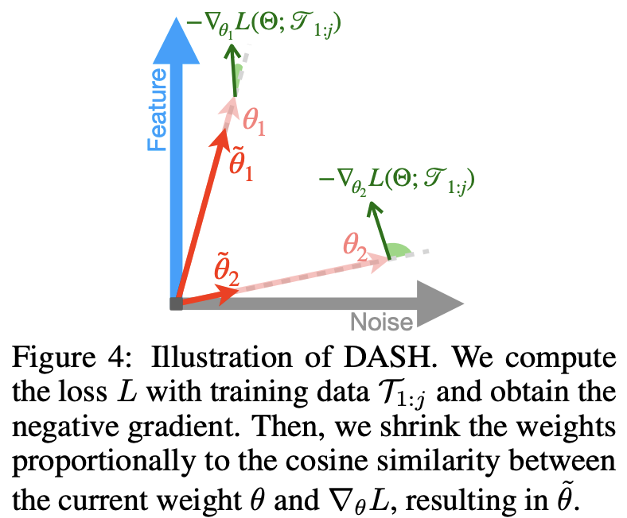

</img>

## DASH (wip)

Implementation of DASH, [Warm-Starting Neural Network Training in Stationary Settings without Loss of Plasticity](https://arxiv.org/abs/2410.23495)

## Citations

```bibtex
@misc{shin2024dashwarmstartingneuralnetwork,
    title   = {DASH: Warm-Starting Neural Network Training in Stationary Settings without Loss of Plasticity}, 
    author  = {Baekrok Shin and Junsoo Oh and Hanseul Cho and Chulhee Yun},
    year    = {2024},
    eprint  = {2410.23495},
    archivePrefix = {arXiv},
    primaryClass = {cs.LG},
    url     = {https://arxiv.org/abs/2410.23495}, 
}
```
